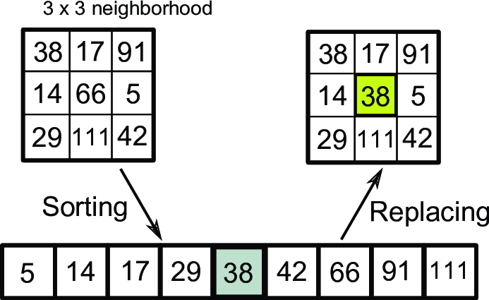
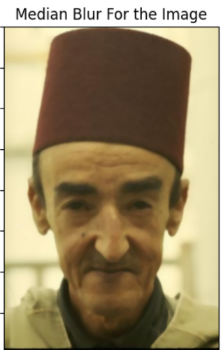
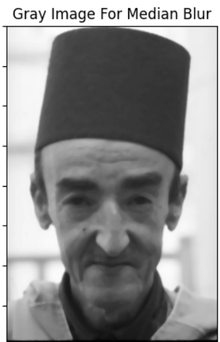
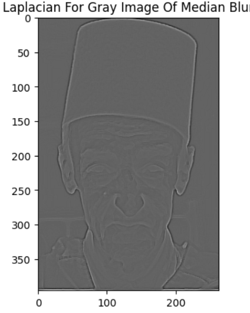
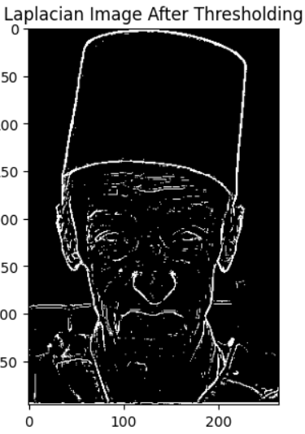
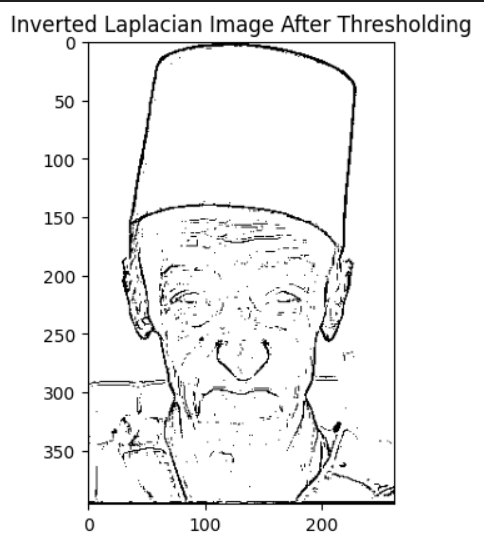
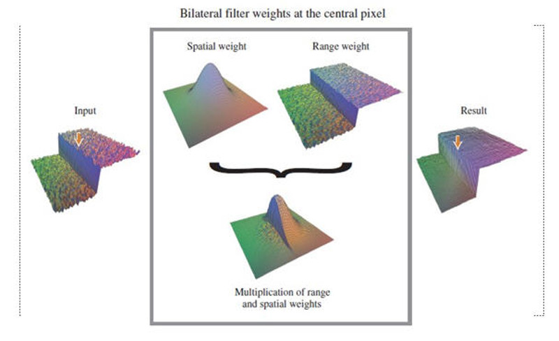
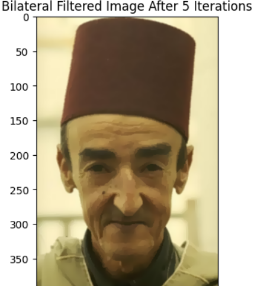
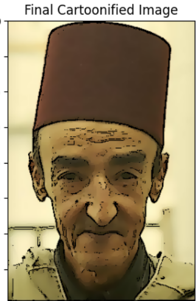

# Applying Image Processing Filters For ImageCartoonifying & Road Lane Detection Using Hough Transform

> This readme file is a summary of the project. For more details, please refer to the notebooks.

## Part 1
## Introduction
- Our objective is to authentically transform real-world images into a cartoon-like appearance. To achieve this, we adopt a two-step approach: accentuating flat regions with vibrant colors and enhancing sharp edges with thick lines. By emphasizing the flatness of certain areas and making edges more pronounced, we effectively create a captivating cartoon or comic book effect. This involves edge detection, smoothing of flat areas, and overlaying the enhanced edges to achieve the desired outcome.

## Steps 
### Applying Median Filter
- The median filter is an effective noise reduction technique that preserves edge sharpness. It replaces each pixel in an image with the median value of its local neighborhood, reducing noise by selecting a value unaffected by outliers. This ensures that edges remain distinct and avoids blurring.

- figures showing median filter and its effect.

### Applying Laplacian Filter
- The Laplacian filter is utilized for edge detection. By applying the Laplacian operator to an image, it highlights regions of rapid intensity change, representing edges. To achieve a sketch-like appearance, a binary threshold is applied, making edges either black or white, enhancing the contrast and emphasizing edge boundaries.

- To apply the Laplacian filter, first convert the image to grayscale if it's colored. Then, convolve the image with a Laplacian kernel, whose size depends on the desired level of edge detection. Afterward, adjust the pixel values to ensure consistent brightness in the resulting edges, which can be achieved by adding a constant value or normalizing the image. Optionally, you can apply a binary threshold to obtain a binary representation of the edges, where edges are either white or black. Finally, visualize the resulting image to examine the detected edges and their quality.

### Applying Thresholding & Inverting Image
- This process effectively applies a binary thresholding operation to the Laplacian image, where pixels with Laplacian values below a certain threshold (in this case, 10) are considered as non-edge regions and set to black, while pixels with Laplacian values above or equal to the threshold are considered as edge regions and remain white. The resulting thresholded image is then displayed with a title indicating its purpose.

### Applying Bilateral Filter
- The bilateral filter is a non-linear, edge-preserving smoothing filter commonly used in image processing. It aims to reduce noise while preserving the important edges in an image. The strength of the bilateral filter is controlled by several parameters: size, color_strength, and positional_strength.The size parameter determines the neighborhood size over which the filter operates. A larger size considers a wider range of pixels in the filtering process.The color_strength parameter controls the filter's sensitivity to the color differences between neighboring pixels. A higher value leads to a stronger effect of color similarity in the filtering process.The positional_strength parameter determines the filter's sensitivity to the spatial distance between neighboring pixels. A higher value causes the filter to be more influenced by pixel positions.

- The bilateral filter is effective in preserving edges while smoothing flat regions, making it a great choice for automatic cartoonification or painting filters. However, the bilateral filter can be extremely slow, taking seconds or even minutes to process an image. To achieve a balance between performance and quality, we can utilize a trick of performing bilateral filtering at a lower resolution. This lower-resolution filtering produces a similar effect to filtering at full resolution but significantly reduces the computational cost and improves processing speed.

- To apply the bilateral filter, the first step is to convert the input image to grayscale if it's a color image. Next, determine the size of the filter kernel, typically a square or circular window centered on each pixel. Calculate the standard deviations for both the spatial and intensity domains, controlling the range of influence for neighboring pixels. Iterate over each pixel in the image and, for each pixel, iterate over the pixels within the kernel window. Compute the spatial distance using Euclidean distance between the central pixel and its neighboring pixel within the kernel. Compute the intensity difference between them and calculate the weight for each neighboring pixel using a Gaussian function that considers both spatial and intensity distances. Multiply the weight by the intensity value of the neighboring pixel and sum up the weighted intensity values within the kernel window. Then, compute the normalization factor by summing up the weights and divide the sum of the weighted intensity values by the normalization factor to obtain the filtered pixel value. Repeat these steps for all pixels in the image, resulting in the final output of the bilateral filtering process.

- positional_strength Threshold: The spatial threshold typically represents the size of the neighborhood and is often defined as a positive, non-zero value. Common values for the spatial threshold range from 1 to 10, where smaller values result in a more localized effect, while larger values encompass a larger spatial neighborhood for smoothing.

- color_strength Threshold: The range threshold usually represents the similarity in pixel values and can be defined as a positive value. The range threshold can vary widely depending on the image data and the desired effect. Typical values for the range threshold are in the range of 0 to 255, where a lower value restricts smoothing to pixels with very similar values, preserving more details and edges, while a higher value allows for a broader range of pixel values to be considered similar, resulting in more smoothing.

### Adding all together
- Our code essentially takes the input image, applies a binary threshold to create a mask, and then replaces the pixel values in the resulting mask with the corresponding pixel values from the input image, resulting in a modified black image where only the pixels that satisfy the specified threshold are preserved.
