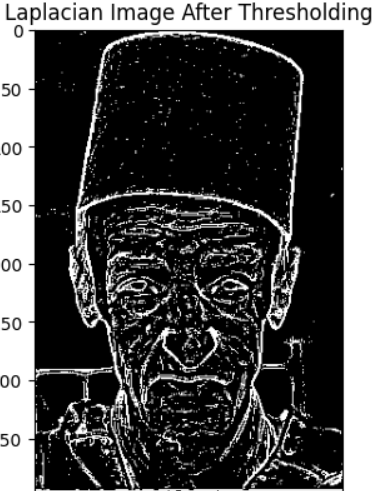
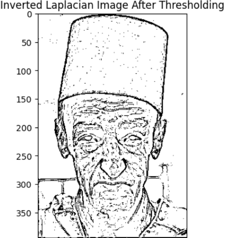

# Applying Image Processing Filters For ImageCartoonifying & Road Lane Detection Using Hough Transform

> This readme file is a summary of the project. For more details, please refer to the notebooks.


## Part 1
## Introduction
- Our objective is to authentically transform real-world images into a cartoon-like appearance. To achieve this, we adopt a two-step approach: accentuating flat regions with vibrant colors and enhancing sharp edges with thick lines. By emphasizing the flatness of certain areas and making edges more pronounced, we effectively create a captivating cartoon or comic book effect. This involves edge detection, smoothing of flat areas, and overlaying the enhanced edges to achieve the desired outcome.

## Steps 
### Applying Median Filter
- The median filter is an effective noise reduction technique that preserves edge sharpness. It replaces each pixel in an image with the median value of its local neighborhood, reducing noise by selecting a value unaffected by outliers. This ensures that edges remain distinct and avoids blurring.


### Applying Laplacian Filter
- The Laplacian filter is utilized for edge detection. By applying the Laplacian operator to an image, it highlights regions of rapid intensity change, representing edges. To achieve a sketch-like appearance, a binary threshold is applied, making edges either black or white, enhancing the contrast and emphasizing edge boundaries.
- To apply the Laplacian filter, first convert the image to grayscale if it's colored. Then, convolve the image with a Laplacian kernel, whose size depends on the desired level of edge detection. Afterward, adjust the pixel values to ensure consistent brightness in the resulting edges, which can be achieved by adding a constant value or normalizing the image. Optionally, you can apply a binary threshold to obtain a binary representation of the edges, where edges are either white or black. Finally, visualize the resulting image to examine the detected edges and their quality.


### Applying Thresholding & Inverting Image
- This process effectively applies a binary thresholding operation to the Laplacian image, where pixels with Laplacian values below a certain threshold (in this case, 10) are considered as non-edge regions and set to black, while pixels with Laplacian values above or equal to the threshold are considered as edge regions and remain white. The resulting thresholded image is then displayed with a title indicating its purpose.



### Applying Bilateral Filter
- The bilateral filter is a non-linear, edge-preserving smoothing filter commonly used in image processing. It aims to reduce noise while preserving the important edges in an image. The strength of the bilateral filter is controlled by several parameters: size, color_strength, and positional_strength.The size parameter determines the neighborhood size over which the filter operates. A larger size considers a wider range of pixels in the filtering process.The color_strength parameter controls the filter's sensitivity to the color differences between neighboring pixels. A higher value leads to a stronger effect of color similarity in the filtering process.The positional_strength parameter determines the filter's sensitivity to the spatial distance between neighboring pixels. A higher value causes the filter to be more influenced by pixel positions.


#### Pseudo Code
- The pseudo code for the PCA:
```python
    # computing the mean
    means=np.mean(training_set,axis=0).reshape(1,10304)
    # centering the data
    centered_training_set=training_set-means
    # computing the covariance matrix
    covariance_matrix=np.cov(centered_training_set.T,bias=True)
    # computing the eigen vectors & eigen values
    eigenvalues,eigenvectors=np.linalg.eigh(covariance_matrix)
    
    # sorting eigen vectors according to their corresponding eigen values
    positions = eigenvalues.argsort()[::-1]
    
    sorted_eigenvectors = (eigenvectors[:,positions])
    
    total = sum(eigenvalues)
    
    # getting the required pcs to reach a certain alpha
    r = 0
    
    current_sum = 0

    while current_sum/total < alpha:
        current_sum += eigenvalues[r]
        r += 1
    # getting the new space that the data will be projected to it 
    new_space = eigenvectors[:, :r]   

    return new_space

```
#### The first 2 Eigen-Faces


####  Comparing different values of alpha to their corresponding accuracies
- this figure shows that accuracy increases as alpha increases until a certain limit.


#### Comparing different values of alpha to their corresponding number of principle components
- this figure shows that number of principle components increase as alpha increases.


#### Comparing alpha to their corresponding accuracies after changing percentage of training split into 70% and test split into 30%
- this figure shows that accuracy increases as alpha increases.
- it is obvious that the curve has the same shape as the last splits but with higher values as the training data has increased.


#### Comparing alpha to their corresponding number of principle components after changing percentage of training split into 70% and test split into 30%
- this figure shows that number of principle components increase as alpha increases until a certain limit.
- it is obvious that the curve has the same shape as the last splits but with higher values as the training data has increased
so the number of principle components needed to handle the same total percentage of the variance increased.


#### Using K-NN Classifier after PCA
- KNN classifier is a non-parametric method used for classification and regression. In both cases, the input consists of the k closest training examples in the feature space. The output is determined by the majority of the classes of the k nearest neighbors.
- The following graph shows the accuracy of face recognition at different values of k (1-3-5-7)


#### Comparison between different splitting ways
- this table shows difference in accuracies


- this table shows difference in number of principle components


#### Using PCA Variations

##### Randomized PCA
  - Randomized PCA is a faster and more memory-efficient version of PCA that uses randomized matrix approximations to estimate the principal components of the data. This approach involves sampling subsets of the data and computing the eigenvectors of the resulting covariance matrix, which can be done more efficiently than computing the eigenvectors of the full covariance matrix.
  - the randomised version of PCA operates in O(nd^2) + O(d^3) where d is the number of principle components, conventional PCA operates in O(np^2) + O(p^3) where n is the number of data points and p is the number of features. Therefore, it moves extremely quickly when d is significantly smaller than n.

##### Kernel PCA
  - Kernel PCA is a non-linear dimensionality reduction technique that uses a kernel function to map high-dimensional data into a lower-dimensional space. This allows it to capture non-linear relationships between variables that are not possible with linear PCA.
  - The time complexity of normal PCA is O(d^3), where d is the number of dimensions, while the time complexity of kernel PCA is O(n^3), where n is the number of data points. The computation of the kernel matrix is the most computationally expensive step in kernel PCA.
  - Kernel PCA may be more accurate than normal PCA for datasets with non-linear relationships between variables, as it can capture these relationships. However, kernel PCA is more prone to overfitting than normal PCA, and the choice of kernel function can greatly affect the performance of kernel PCA.

#### Figure showing accuracies for PCA variations
- Kernel PCA, specifically using the radial basis function (RBF) kernel, may fail when the dataset has a large number of dimensions or when the number of data points is much larger than the number of dimensions. This is because the kernel matrix can become very large and computationally expensive to compute and manipulate. Additionally, the choice of kernel function and its parameters can greatly affect the performance of kernel PCA. In contrast, normal PCA may perform better in high-dimensional datasets or when the relationships between variables are linear, as it is designed to capture linear relationships between variables.
- RBF kernel PCA uses the radial basis function kernel, which is a Gaussian function that measures the distance between data points in the original space. This kernel is useful for capturing non-linear relationships between variables that cannot be captured by linear PCA.While Polynomial kernel PCA uses a polynomial kernel, which is a power function that measures the dot product between data points in the original space raised to a certain power. This kernel is also useful for capturing non-linear relationships between variables, but is more sensitive to outliers and noise than the RBF kernel.

- 

### LDA 
- Linear Discriminant Analysis (LDA) is a dimensionality reduction technique that is used to reduce the number of features in a dataset while maintaining the class separability. LDA is a supervised technique, meaning that it uses the class labels to perform the dimensionality reduction. LDA is a popular technique for dimensionality reduction in the field of pattern recognition and machine learning. 


#### Pseudo Code
- The pseudo code for the multi-class LDA is as follows:
```python
    # Step 1: Compute the overall mean of the training set
    overall_mean = compute_mean(training_set)

    # Step 2: Compute the between-class scatter matrix and the within-class scatter matrix
    S_B = compute_between_class_scatter(training_set, overall_mean)
    S_W = compute_within_class_scatter(training_set)

    # Step 3: Compute the eigenvalues and eigenvectors of the generalized eigenvalue problem
    eigenvalues, eigenvectors = compute_generalized_eigen(S_B, S_W)

    # Step 4: Sort the eigenvalues and eigenvectors in descending order
    sorted_eigenvalues, sorted_eigenvectors = sort_eigen(eigenvalues, eigenvectors)

    # Step 5: Take only the dominant eigenvectors
    new_space = select_eigenvectors(sorted_eigenvectors)

    # Step 6: Return the dominant eigenvectors
    return new_space
```


#### Using K-NN Classifier after LDA
- KNN classifier is a non-parametric method used for classification and regression. In both cases, the input consists of the k closest training examples in the feature space. The output is determined by the majority of the classes of the k nearest neighbors.
- The following graph shows the accuracy of face recognition at different values of k (1-3-5-7)


#### Comparison between different splitting ways
- We Tried splitting the data into training and test in 2 different ways:
1. 50-50: This splitting resulted in a good accuracy reaching 95.5%
2. 70-30: This splitting resulted in a slightly better accuracy reaching 95.83%

#### Using LDA Variations
- We tried using different variations of LDA to see if we can get better results. The variations we tried are:
##### Shrinkage LDA
- Shrinkage LDA (Linear Discriminant Analysis) is a variant of the standard LDA method that is used for classification and dimensionality reduction. The key difference between shrinkage LDA and normal LDA is that the former incorporates a regularization term that shrinks the sample covariance matrix towards a diagonal matrix.

- This regularization is particularly useful when dealing with high-dimensional data, as it helps to overcome the small sample size problem by stabilizing the covariance estimates. Shrinkage LDA has been shown to outperform traditional LDA in terms of classification accuracy, especially when the number of features is much larger than the number of observations.

- Another advantage of shrinkage LDA is that it can handle multicollinearity between the predictor variables, which can be a problem in standard LDA when the predictors are highly correlated. In summary, shrinkage LDA is a powerful tool for classification and dimensionality reduction that can improve the accuracy of LDA in high-dimensional and small sample size settings.

#### Figure showing accuracies for LDA variations


## Comparing to Non-Faces Dataset
- We compared the results of the PCA and LDA algorithms to the results of the same algorithms on a non-faces dataset. The non-faces dataset is the []() dataset. The results are discussed inside the [notebook](faces_vs_nonfaces.ipynb).

## Faces VS Non-Faces Solutions__

1. Success & failure cases figure
   - PCA
   - 
   - LDA
   - 


2. We will use 1 dominant eigenvector for LDA as we have 2 classes
3. Accuracy vs number of non-face images figure
    - PCA
    - 
    - LDA
    - 

4. As the number of non-face images increases, the accuracy of the classifier decreases, in contrast to what might be expected. This is because the number of points in the space increases, and the K-NN classifier is more likely to be confused by the noise in the data. This is a limitation of the classifier, and is not a problem with the data. The noise causes the space to be more complex and the gaps between the classes to be smaller and smaller which is more likely to cause confusion for the K-NN classifier.
  


## Contributers

- [Yousef Kotp](https://github.com/yousefkotp)

- [Mohamed Farid](https://github.com/MohamedFarid612)

- [Adham Mohammed](https://github.com/adhammohamed1)

 
